# MANUAL TÉCNICO

## INTEGRANTES

| Nombre                           | Carné                                      |
|:--------------------------------:|:------------------------------------------:|
| Daniel Reginaldo Dubón Rodríguez | 201901772                                  |
| Erick Ivan Mayorga Rodríguez     | 201901758                                  |
| Edmy Marleny Mendoza Pol         | 201901212                                  |
| Kevin Steve Martínez Lemus       | 202004816                                  |

# INTRODUCCIÓN

Se realizó un letrero que muestra la frase "^PRAC1-GRUPO13-SECC A^", pudiendo controlar su velocidad y dirección de desplazamiento, asi mismo se le integró el juego de tetris, esta práctica se hizo de forma simulada y se realizó a traves del programa Proteus también se hizo uso del lenguaje C++ para poder programar las acciones que debe realizar la placa arduino.

# COMPONENTES UTILILZADOS
## 1 Arduino Mega
<!-- { width: 100px; } -->

## 2 Matriz LED 8x8
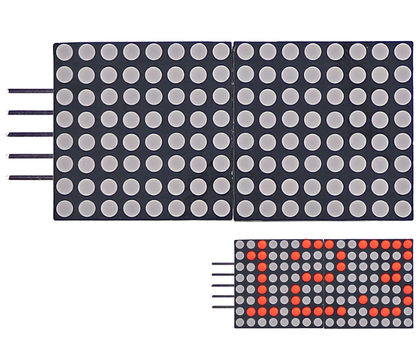

## 1 Potenciometro
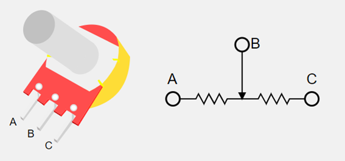

## 4 Botones
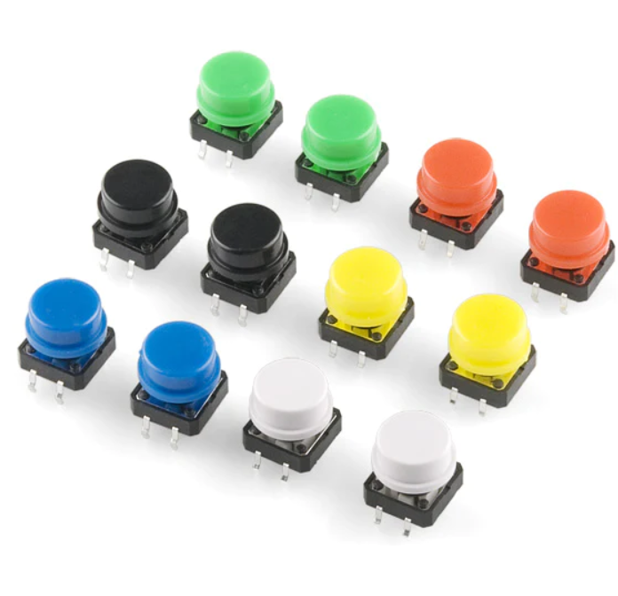

## 1 Driver MAX7219
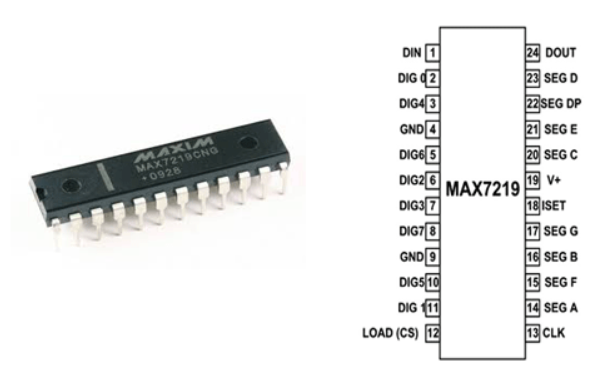

# DIAGRAMA EN PROTEUS
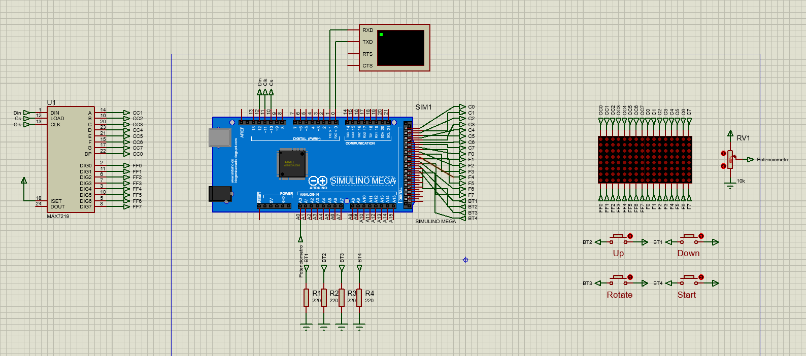

# REQUERIMIENTOS DEL SISTEMA
- Sistema operativo Windows o MacOs (windows 8.1 o superior)
- Proteus v8.10
- Librerias Simulino
- 8GB de ram (minimo)

# CODIGO UTILIZADO

## Declaración de variables globales
Estas variables nos permitirán almacenar y modificar en tiempo de ejecucion el estado y comportamiento de la tarjeta arduino.

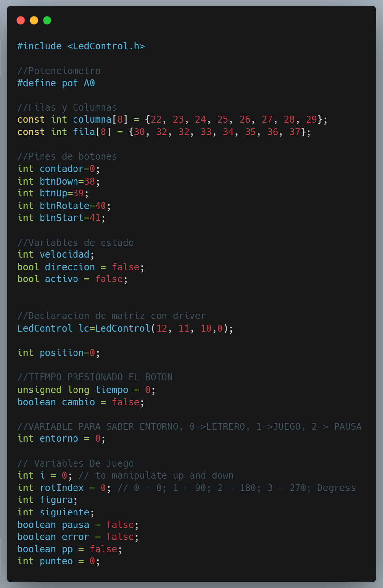

## Frases en matrices binarias
Acá se encuentra escrita la frase ^PRAC1-GRUPO13-SECC A^" dentro de una matriz binaria, que servira para recorrerla y visualizar el efecto scroll en las matrices led.

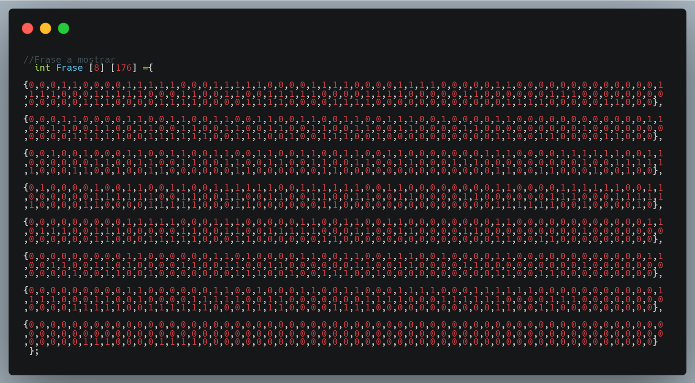

## Declaracion de pines
En esta sección se inicializa la comunicacion serial de arduino con el comando `Serial.begin(9600);`, que esta nos permitira visualizar el estado de arduino a traves de un monitor serial.

Tambien se declaran los pines de entrada y salida por donde se estará enviando la señal a las matrices led y recibiendo pulsos de los botones que indicaran una accion a realizar.

Asi mismo se setean los parametros para usar el dirver `MAX7219`

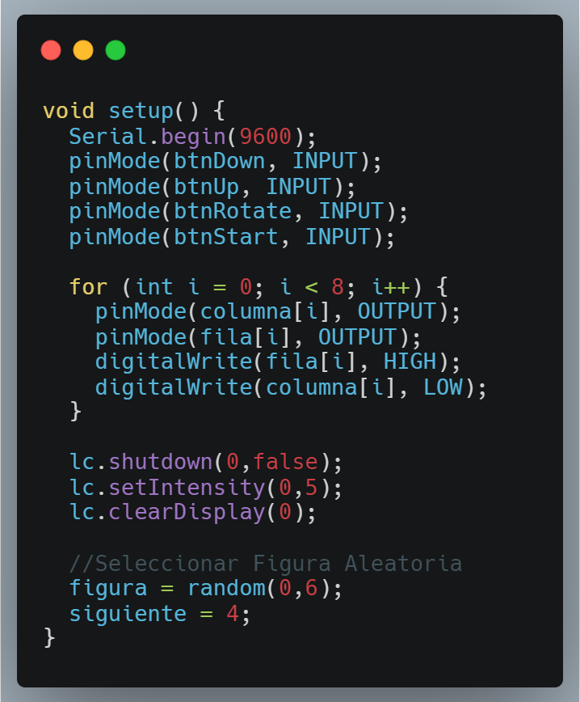

## Métodos de seleccion matriz led

Estos metodos nos permiten seleccionar una fila y una columna en espeficio y como el resultado de la interseccion permite encender un led en una posicion indicada.

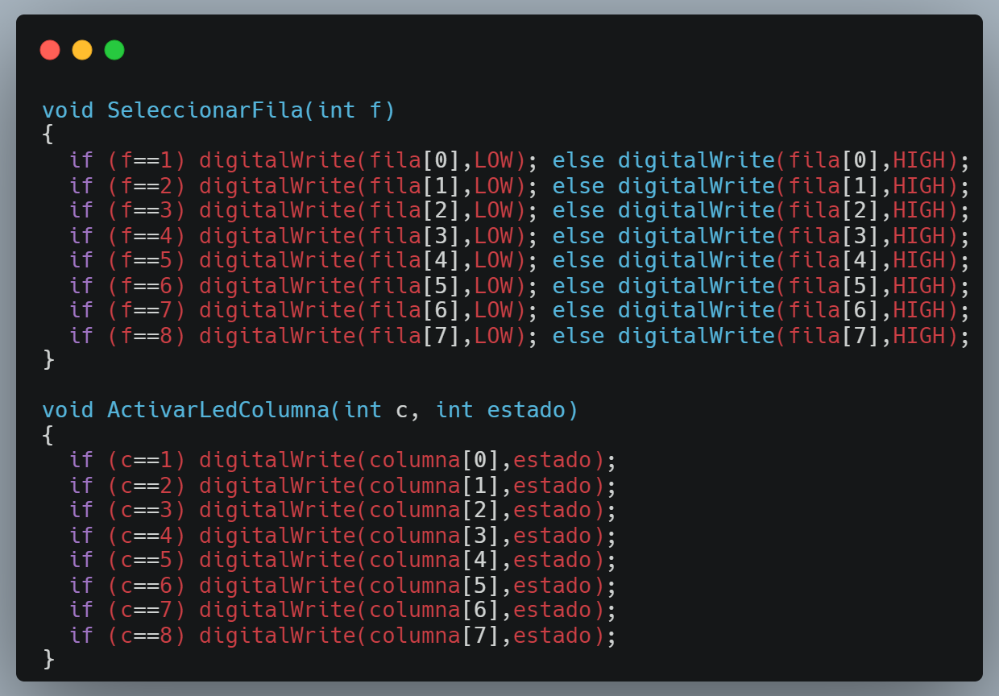

## Entrada de datos por los botones

Por medio de `analogRead()` obtenemos una entrada analogica con la que podemos leer los valores de un potenciometro y con esto poder variar la veloacidad del letrero.

Con `digitalRead` podemos concocer si algun boton fue presionado.

Con `milis()` podemos determinar cuantos milisegundos han transcurrido y con esto cambiar de modo.

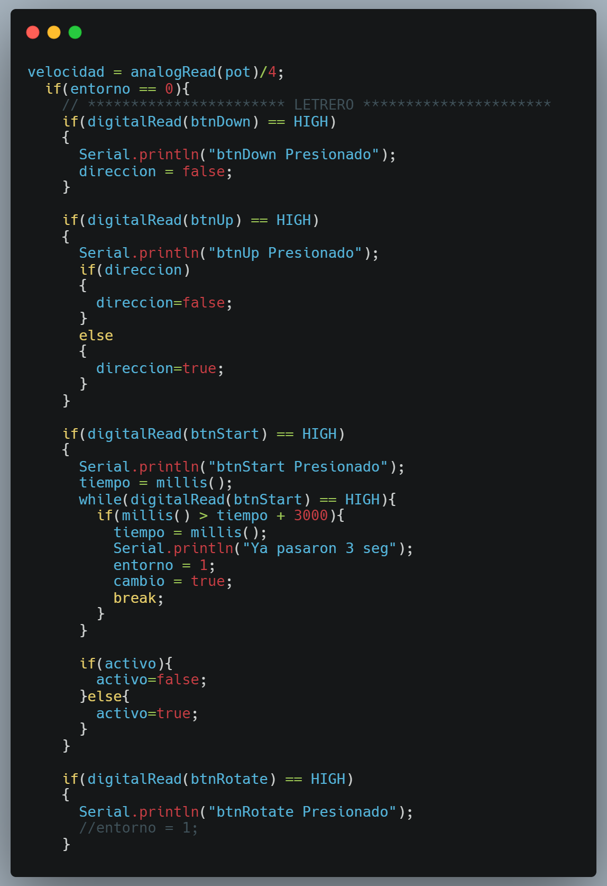

## Efecto scrolling con la frase

Por medio de las iteraciones con los ciclos for se pudo recorrer la matriz con la frase escrita en binario y con `lc.setLed` se muestra el mensaje en la matriz que se controla con driver y con  `ActivarLedColumna` se muestra el mensaje en la matriz sin driver

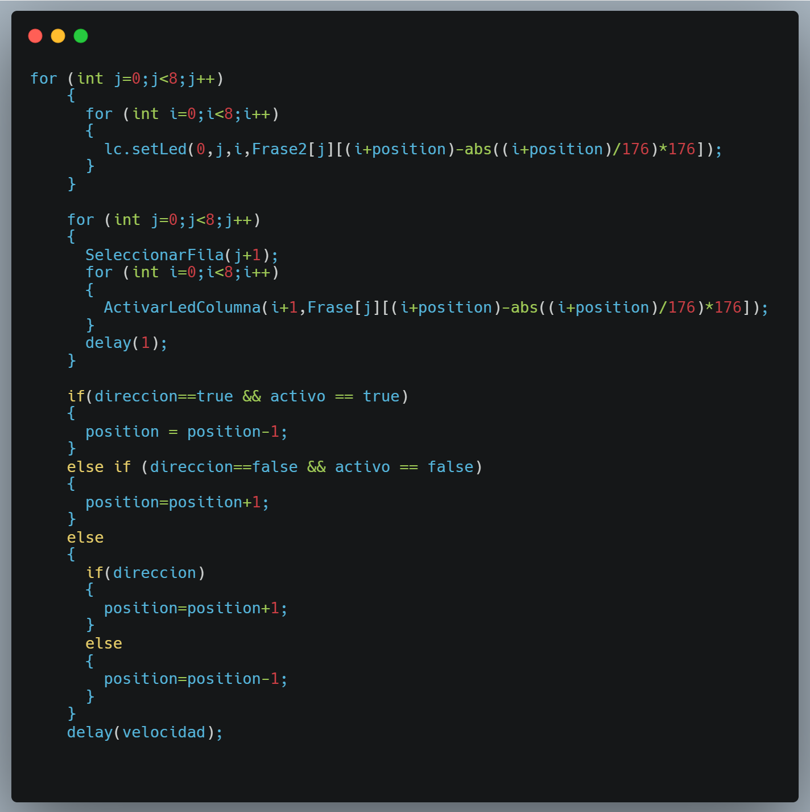

## Creación de figuras

Con el método `createFigures` permite crear las diferentes figuras del juego tetris y con los metodos `fillLedsWithDriver` `fillLedsWithDriver` permite pintarlas en las matrices led tanto con driver como sin driver.

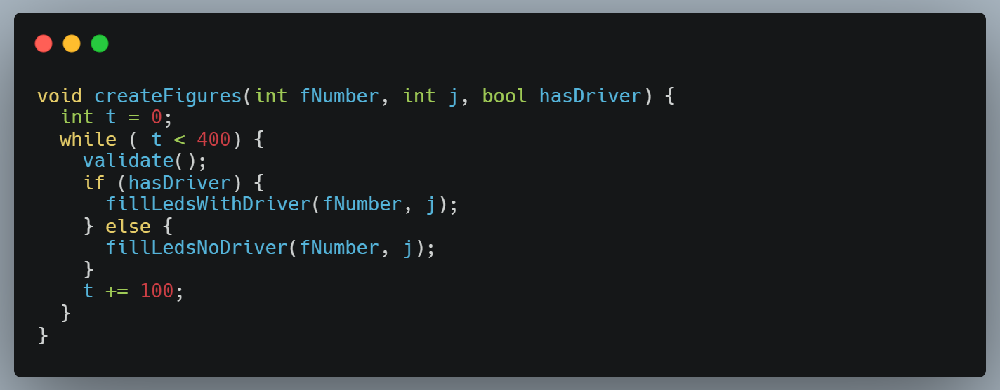

## Sistema de pausa

Sistema de pausa del juego tetris, con el se pude pausar, reanuar, ver los puntos acumulados, reiniciar el juego.

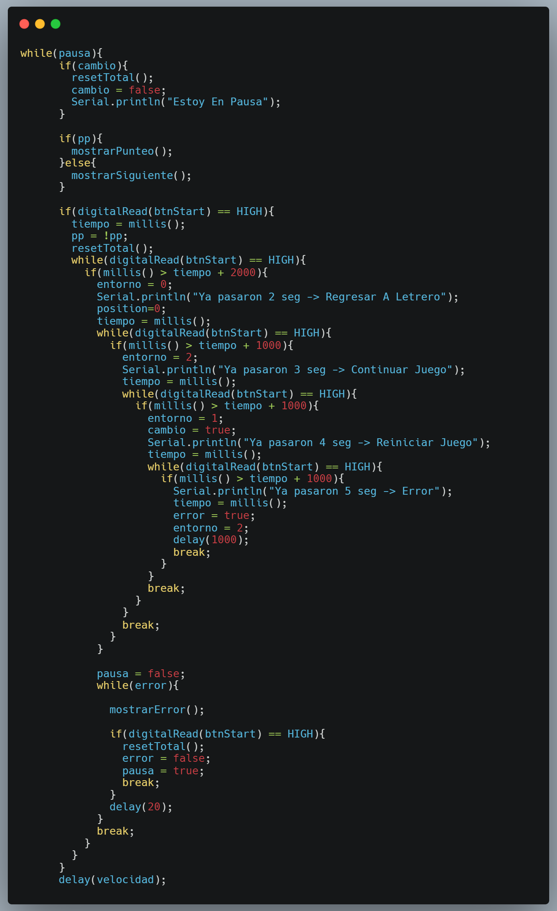

# CONCLUSIONES

- Arduino es una placa basada en un microcontrolador el cual nos permite programarla a travez del lenguaje de programacion c++ y nos permite poder crear proyectos de electronica desde sencillos hasta complejos gracias a que este es modular.

- Las matrices led nos permite dibujar y mostrar información de forma visual.

- Gracias al efecto de la multiplexacion se es posible poder mostrar informacion en la matrices led.