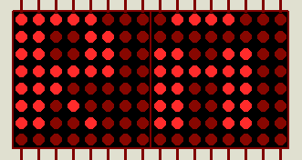
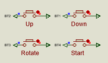
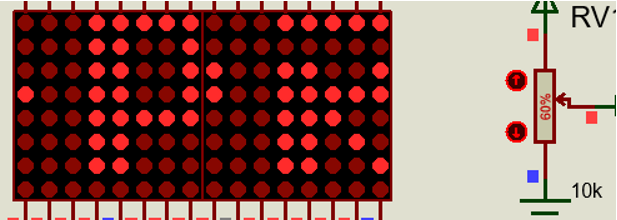
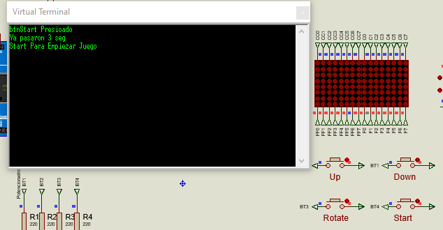
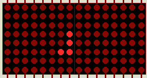
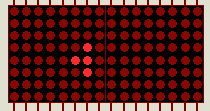
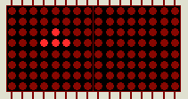
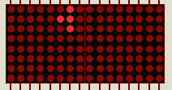
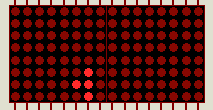

# Practica 1 - Manual De Usuario

Matrices con mensaje desplazable tipo scroll ademas de ser capaz de
iniciar un juego tipo tetris.

## Grupo 13

|Carnet            | Nombre                                                              |
| ----------------- | ------------------------------------------------------------------ |
| 201901212 | Edmy Marleny Mendoza Pol |
| 201901758 | Erick Ivan Mayorga Rodríguez |
| 201901772 | Daniel Reginaldo Dubón Rodríguez |
| 202004816 | Kevin Steve Martínez Lemus |

## Funciones de la Aplicación

- Mensaje - Tipo Scroll
- Juego - Tipo Tetris

## Mensaje - Tipo Scroll
En las matrices usted podrá observar el mensaje inicial de: "^PRAC1-GRUPO13-SECC A^"

Para cambiar de dirección se usa los siguientes botones:

- El botón UP cambiara la dirección de desplazamiento de Derecha -> Izquierda
- El botón DOWN cambiara la dirección de desplazamiento de Izquierda -> Derecha

*** El cambio de dirección se deberá mostrar hasta que se presione el botón Start ***

- La velocidad de desplazamiento será controlada por medio de un potenciómetro.

SALIDA DEL MENSAJE 

Para salir del mensaje se debe presionar por 3 segundos el botón Start.

El salir del mensaje nos llevará a iniciar el juego.

## Juego - Tetris

En esta versión se acumulan puntos por completar columnas llenas de 8 bloques.

La orientación será horizontal y su sentido de derecha a izquierda, lo que quiere decir que las piezas nuevas
deberán aparecer desde el lado derecho y serán llevadas hacia el lado izquierdo.

ROTACIÓN DE PIEZAS 

La rotación de piezas es hacia la derecha.

Los botones UP y DOWN moverán un espacio la pieza cada vez que sea presionado uno de esos botones.

Puntos: se suma un punto por cada columna de 8 bloques completada, además de tener que eliminar la línea
de la visualización y se debe correr hacia la izquierda cualquier estructura a la derecha que no haya sido
eliminada hasta tener contacto con las columnas restantes o la primer columna de la izquierda.

Finalizar Juego: el juego finaliza cuando la última pieza no se puede suplir por encontrarse ocupado, por otra
estructura, el espacio en que debería ser desplegada.
Luego

## MENU DE PAUSA

Para entrar a pausa se debe presionar el botón "Start" por 3 segundos.

Dentro del menú de pausa, cada vez que pulse el botón "Start" intercambiará entre puntos y siguiente pieza.

- Si se presiona por 2 segundos el botón "Start" saldrá al mensaje inicial.
- Si se presiona por 3 segundos el botón "Start" reanudará el juego.
- Si se presiona por 4 segundos el botón "Start" reiniciará el juego tanto en puntos como en contenido de
- las matrices, vuelve a iniciar desde cero la jugabilidad.
- Si se presiona por más de 5 segundo el botón "Start" Mostrará "EE", un caracter en cada matriz, y quedará esperando a que se pulse el botón "Start" para volver a mostrar el estado de las matrices previo al error.
